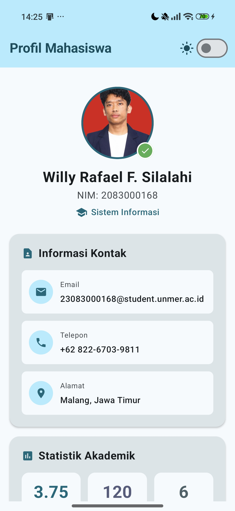
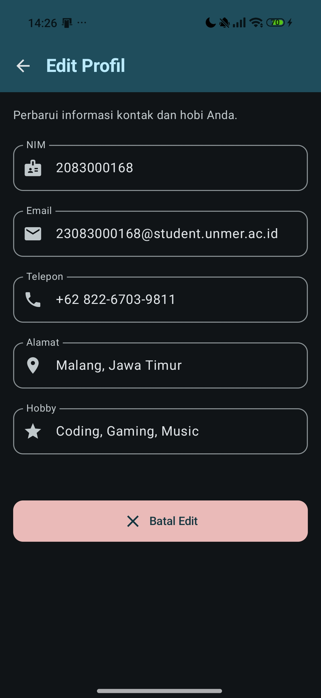
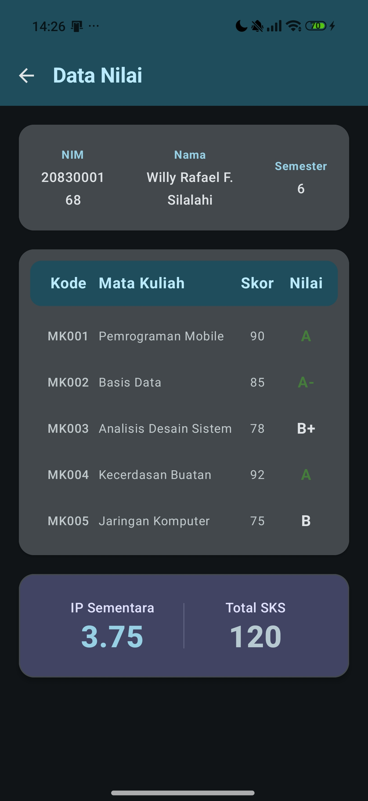
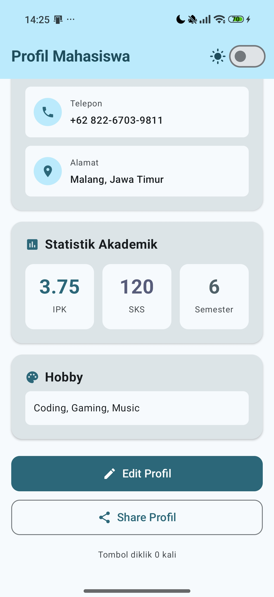

# 📱 Week 2 - Jetpack Compose Fundamentals
## Praktikum: Aplikasi Profil Mahasiswa

---

## 👤 Identitas Mahasiswa
- **Nama:** Willy Rafael F. Silalahi
- **NIM:** 2083000168
- **Mata Kuliah:** Pemrograman Mobile
- **Instansi:** Universitas Merdeka Malang

---

## 📝 Ringkasan Projek
Aplikasi **Profil Mahasiswa** adalah aplikasi Android berbasis **Jetpack Compose** yang dikembangkan untuk memenuhi tugas praktikum minggu ke-2. Aplikasi ini mendemonstrasikan fundamental UI deklaratif, pengelolaan state, navigasi antar screen, dan implementasi Material Design 3. Fitur utama mencakup tampilan profil yang interaktif, form edit profil dengan sinkronisasi data (termasuk edit NIM), serta ringkasan nilai akademik dengan tampilan kartu yang diperjelas.

---

## 📸 Screenshots

| Feature | Screenshot (Light Mode) | Screenshot (Dark Mode) | Deskripsi |
|---------|-------------------------|-------------------------|-----------|
| **Profile Screen** |   |   | Halaman utama yang menampilkan foto, info kontak, dan statistik akademik. |
| **Edit Profile** |  |  | Form untuk mengubah data NIM, Email, Telepon, dll secara real-time. |
| **Data Nilai** |  |  | Tampilan ringkasan akademik dan daftar mata kuliah dengan card yang diperjelas. |

---

## 🚀 Cara Menjalankan

### Prerequisites
- Android Studio Ladybug (2024.2.1) atau versi lebih baru.
- JDK 17 atau lebih baru.
- Koneksi internet (untuk sinkronisasi Gradle).

### Langkah-langkah
1. **Clone Repository**
   ```bash
   git clone https://github.com/willyrafaelfs/Pemrograman-Mobile-Profil-Mahasiswa.git
   ```
2. **Buka di Android Studio**
   - Pilih **File > Open**
   - Pilih folder project `Week2_ProfilMahasiswa`
3. **Build & Run**
   - Tunggu Gradle sync selesai.
   - Klik **Run** (▶) atau tekan `Shift + F10`.
4. **Preview UI**
   - Buka file di folder `screens/` (misal: `ProfileScreen.kt`).
   - Klik tab **"Split"** atau **"Design"** di pojok kanan atas editor.

---

## 🎯 Tujuan Pembelajaran
*(Materi Praktikum)*
Setelah menyelesaikan praktikum ini, mahasiswa mampu:
1. Memahami perbedaan paradigma **Imperatif** (XML) vs **Deklaratif** (Compose)
2. Membuat dan memanggil fungsi **@Composable**
3. Menggunakan layout dasar: **Column**, **Row**, **Box**
4. Menerapkan **Modifier** untuk styling (padding, background, border, size)
5. Mengelola **State** dengan `remember` dan `mutableStateOf`
6. Menggunakan komponen **Material 3**: Card, Button, Scaffold, TopAppBar
7. Membuat **@Preview** untuk melihat UI di Android Studio

---

## 📁 Struktur Project

```
Week2_ProfilMahasiswa/
├── app/
│   ├── build.gradle.kts          ← Konfigurasi dependencies
│   └── src/main/
│       ├── AndroidManifest.xml    ← Manifest aplikasi
│       ├── java/com/example/profilmahasiswa/
│       │   ├── MainActivity.kt    ← Entry point & State Management
│       │   ├── screens/
│       │   │   ├── ProfileScreen.kt  ← UI Utama Profil
│       │   │   ├── ProfileEdit.kt    ← Form Edit Profil
│       │   │   └── DataNilaiScreen.kt ← Detail Akademik
│       │   └── ui/theme/
│       │       └── Theme.kt       ← Konfigurasi warna & tema
│       └── res/
│           ├── drawable/          ← Asset gambar & ikon
│           └── values/themes.xml
├── build.gradle.kts
└── settings.gradle.kts
```

---

## 🔑 Konsep Kunci yang Dipelajari

### 1. @Composable Function
Anotasi `@Composable` menandai fungsi sebagai builder UI. Nama fungsi menggunakan **PascalCase**.

### 2. Layout: Column, Row, Box
- **Column** → Menyusun children **vertikal** (↓)
- **Row** → Menyusun children **horizontal** (→)
- **Box** → **Menumpuk** children (stack/overlap)

### 3. Modifier (Rantai Styling)
Digunakan untuk mengatur ukuran, padding, background, dan interaksi. Urutan pemanggilan sangat berpengaruh.

### 4. State & Recomposition
Menggunakan `remember` dan `mutableStateOf` agar Compose dapat mendeteksi perubahan data dan melakukan render ulang pada komponen yang terpengaruh.

---

## 📚 Referensi
- [Jetpack Compose Tutorial (Android Developers)](https://developer.android.com/jetpack/compose/tutorial)
- [Compose Layout Basics](https://developer.android.com/jetpack/compose/layouts/basics)
- [State and Compose](https://developer.android.com/jetpack/compose/state)
- [Material 3 Components](https://developer.android.com/jetpack/compose/designsystems/material3)
